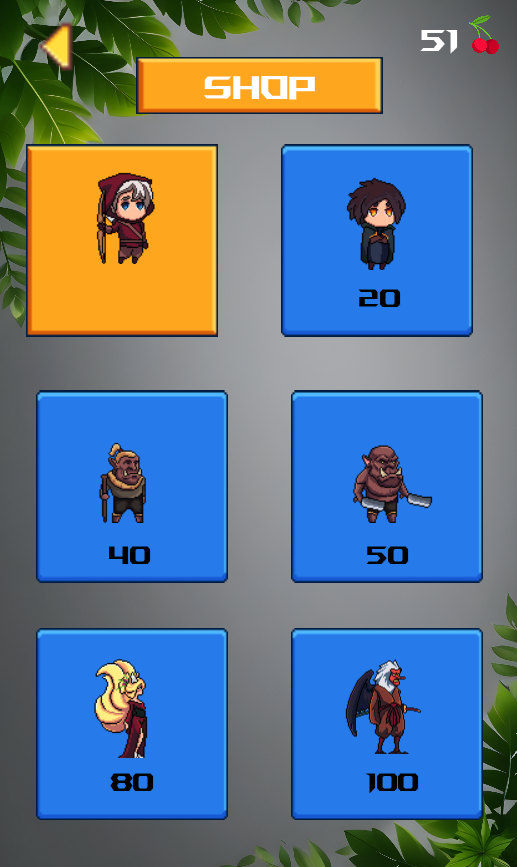

# Stick Hero

## Introduction
Stick Hero is an engaging and interactive game where a character named Stick Hero traverses between platforms by stretching out a stick. The objective is to bridge gaps between platforms accurately to avoid falling into the abyss, while collecting cherries and scoring points.

 *(Make sure to replace this placeholder with an actual screenshot from your game)*

## Game Mechanics
- **Character Movement**: Control Stick Hero using key presses to extend a stick and flip the character.
- **Pillars**: Randomly generated of varying widths and positions.
- **Cherry Collection**: Collect cherries by flipping Stick Hero upside down while in the air.
- **Revive Feature**: Use 3 cherries to revive the character once if they fall.
- **Pause Functionality**: Pause the game to quit or save progress at any time.
- **User Authentication**: Sign up and log in using MySQL database to store user details.
- **Multiple Avatars**: Choose from several avatars to play with and unlock new ones using cherries.
- **Marketplace**: Use collected cherries to buy new avatars.

## Key Controls
- **A**: Extend the stick while holding the key.
- **SPACE**: Flip Stick Hero upside down.
- **S**: Save the game progress.
- **top-left**: Use Pause icon to pause the game.

## Features
- **Serialization**: Save game progress including score, highest score, and total cherries.
- **Random Pillar Generation**: Pillars are generated with random widths and positions.
- **Scoring System**: Earn points by collecting cherries; score is displayed at the top of the screen.
- **Graphics and Music**: Enhanced with images and music files located in the resources folder.
- **Multithreading**: Implemented in the MusicPlayer class for concurrent sound playback.
- **User Authentication**: Login and signup functionality using MySQL.
   *(Placeholder for login screen image)*
- **Avatar Selection**: Multiple avatars available for selection and unlocking.
   *(Placeholder for avatar selection image)*
- **Marketplace**: Purchase new avatars using collected cherries.
   *(Placeholder for marketplace image)*
  - **Database Integration**: Connects to MySQL database to store user high scores, cherry count, ID, and password.
   *(Placeholder for database connection image)*

## Game Menus
- **Home Screen**: Start a new game, load a saved game, or log in.
- **Game Over Menu**: Options to go to the home screen, save current progress, or revive gameplay (if cherries are available).

## OOP Concepts Used
- **Singleton Pattern**: Ensures a single instance of the StickHero class.
- **Decorator Pattern**: Used for the media player.
- **Flyweight Pattern**: Optimizes memory usage by sharing pillar objects based on their widths.

## Project Structure
- **Main Class**: `src/main/java/com/example/stickhero/Start3.java` - Run this file to start the game.
- **Resources**: Contains images, sounds, and other media files.
- **Serialization**: Save and load game states using serialized objects.
- **Database**: MySQL integration for user authentication and high score storage.

## How to Run
1. Clone the repository.
   ```sh
   git clone https://github.com/aethernavshulkraven-allain/StickHero.git
2. Set up the MySQL database:
   Use the database dump file javafx-video_game_users.sql to set up the database locally on your machine.
3. Add the mysql-connector-j-8.2.0.jar JAR file to your project structure.
4. Compile and run the game.
